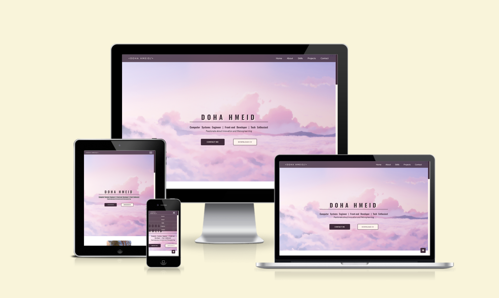
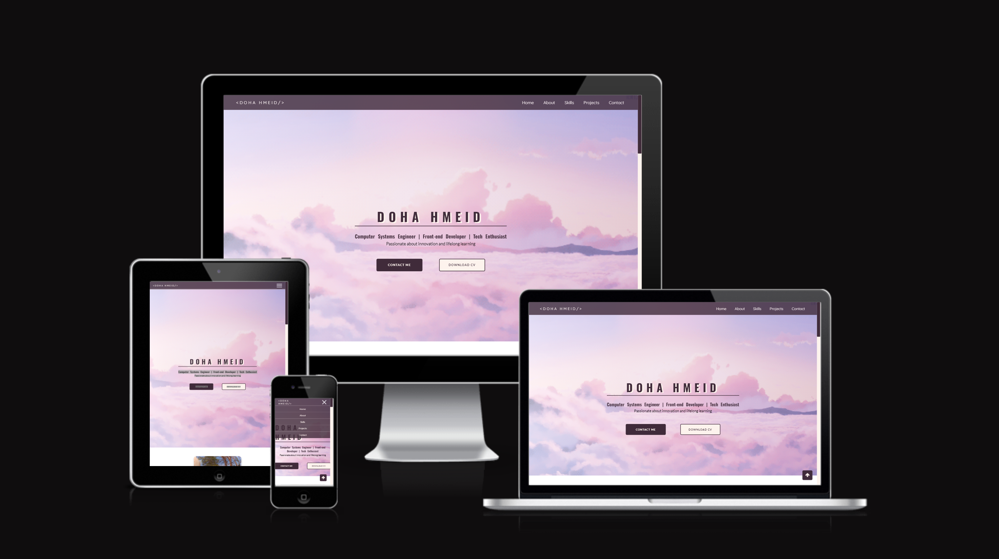

    <h1>:star2:	Portfolio :star2:</h1>

<h2>FTS-TASK3 - Building Personal Portfolio</h2>

This repository contains a personal portfolio website built using HTML5 & CSS3 as a part of FTS training plan :dizzy:

## :dart: Key Features
- **Supports Web Accessibility**: The portfolio is designed to be accessible to users with disabilities, following best practices for web accessibility.
- **Responsive Design**: The portfolio is responsive and adapts to all types of devices/screens, including desktops, tablets, and mobile phones.
- **Pages Included**:
  - **Nav Bar**: Navigation bar for easy navigation throughout the portfolio.
  - **Home Page**: Introduces the user to the portfolio and provides an overview.
  - **About Page**: Provides information about the owner of the portfolio.
  - **Skills Page**: Showcases the skills and expertise of the owner.
  - **Projects Page**: Highlights various projects undertaken by the owner.
  - **Contact Page**: Provides contact information and a way for visitors to get in touch.

## :space_invader: Tech Stack & Tools Used

    
    
    
    
    
    

## :art: Color Reference

 
    
| Color | Hex |
| --------------- | ---------------------------------------------------------------- |
| Primary Color |  #402b3a |
| Secondary Color1 |  #b8a7cbff |
| Secondary Color2 |  #fbd7e1 |
| Secondary Color3 |  #e39bc4 |
| Secondary Color4 |  #fdf3edff |

## :eye: Website Preview

## :handshake: Contact
Doha Hmeid --

doha.hmeid@gmail.com

Project Link: [https://github.com/dohmeid/portfolio.git](https://github.com/dohmeid/portfolio.git)
